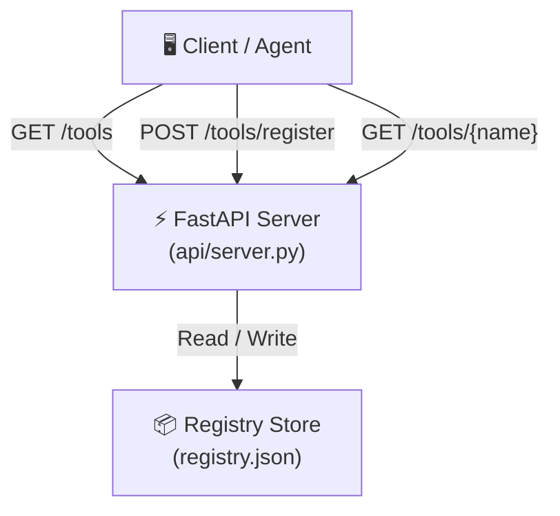

# 🚀 OpenAgentHub

> A lightweight AI Agent tool registry and marketplace — think **npm, but for AI agents**.

OpenAgentHub provides a simple, self-hostable API for discovering, registering, and managing AI agent tools. It is designed to be the central catalog where developers publish their agent capabilities and consumers find the right tool for the job.

## ✨ Features

- **Tool Registry** — Register AI agent tools with metadata (name, version, author, entry point).
- **Discovery API** — Browse and search the tool marketplace via RESTful endpoints.
- **Lightweight & Fast** — Built on FastAPI with a simple JSON file as the data store. Zero external database dependencies.
- **Self-Hostable** — Run your own private registry in seconds.

## 🏗️ Architecture



## 📂 Project Structure

```
OpenAgentHub/
├── api/
│   └── server.py        # FastAPI application with all route handlers
├── registry.json        # JSON-based tool registry (data store)
├── .gitignore
└── README.md
```

## 🚀 Quick Start

### Prerequisites

- Python 3.9+
- pip

### Installation

```bash
# Clone the repository
git clone https://github.com/<your-username>/OpenAgentHub.git
cd OpenAgentHub

# Create a virtual environment
python -m venv .venv
source .venv/bin/activate   # On Windows: .venv\Scripts\activate

# Install dependencies
pip install fastapi uvicorn pydantic
```

### Run the server

```bash
uvicorn api.server:app --reload --port 8000
```

Then open [http://localhost:8000/docs](http://localhost:8000/docs) to explore the interactive Swagger UI.

## 📡 API Endpoints

| Method | Endpoint               | Description                        |
| ------ | ---------------------- | ---------------------------------- |
| GET    | `/`                    | Health check                       |
| GET    | `/tools`               | List all registered tools          |
| POST   | `/tools/register`      | Register or update a tool          |
| GET    | `/tools/{tool_name}`   | Get details of a specific tool     |

### Example: Register a new tool

```bash
curl -X POST http://localhost:8000/tools/register \
  -H "Content-Type: application/json" \
  -d '{
    "name": "web-scraper-agent",
    "version": "0.1.0",
    "description": "An agent that scrapes and summarizes web pages",
    "author": "alice",
    "entry_point": "http://localhost:9000/scrape"
  }'
```

## 🛣️ Roadmap

- [ ] Authentication & API keys
- [ ] Tool versioning and changelogs
- [ ] Full-text search across tools
- [ ] Database backend (SQLite / PostgreSQL)
- [ ] CLI client (`openagent install <tool>`)
- [ ] Web-based dashboard

## 📄 License

This project is open-source and available under the [MIT License](LICENSE).
