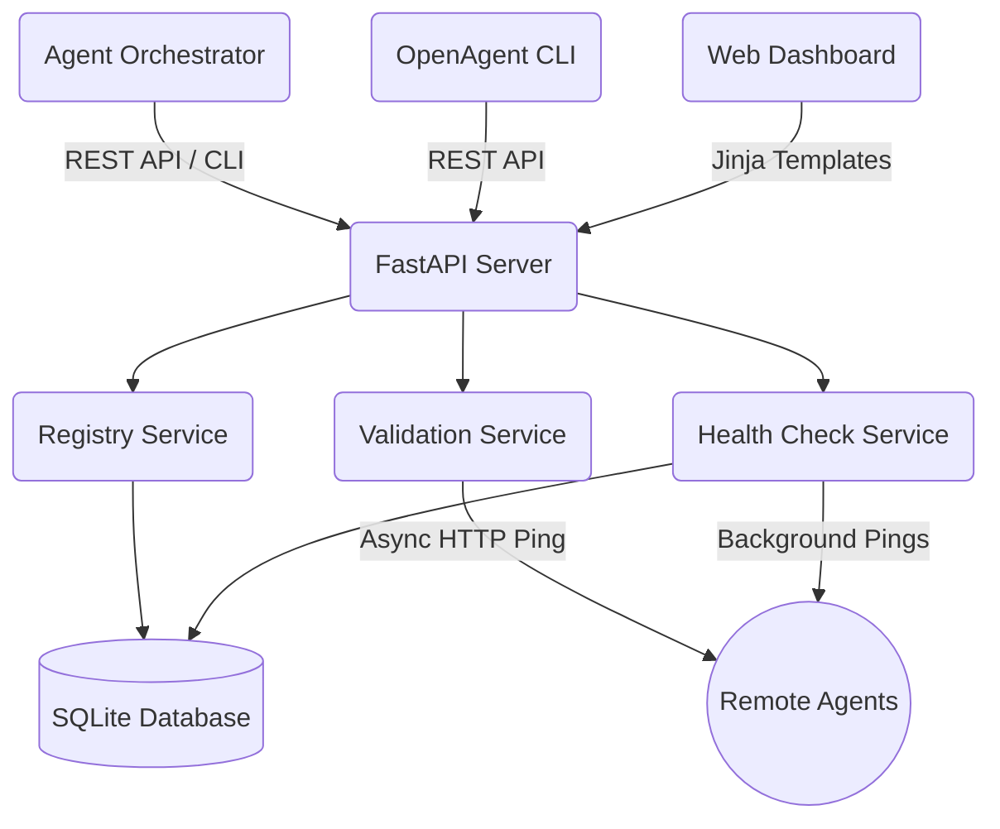

# OpenAgentHub

**A lightweight open-source platform for registering, discovering, validating, and monitoring AI agent tools.**

[](https://github.com/thz20000921-ship-it/OpenAgentHub/actions)
[](https://opensource.org/licenses/MIT)

## What problem it solves

Building complex, multi-agent workflows requires developers to wire together various AI agent endpoints. Managing these remote tools manually leads to scattered configuration files, broken production workflows due to unavailable endpoints, and an unmaintainable developer experience. 

## Why existing agent tooling is fragmented

Currently, the ecosystem defines how agents *think* or *act* (like LangChain, LlamaIndex, or AutoGen), but lacks standard infrastructure to *manage* them. Developers need a centralized registry where tools can be dynamically registered, tagged, and actively monitored for their network health.

## What OpenAgentHub does

OpenAgentHub helps developers manage AI agent tools through a unified registry with discovery, validation, and health monitoring. It is designed for teams building agent workflows who need a simple way to organize and verify tool endpoints.

It acts as the single source of truth for your agent network.

## Core features

- **Tool Health Check:** Active monitoring tracking whether agents are `online`, `offline`, or `timeout`, recording exact response latencies.
- **Validate Tool on Register:** Strict validation on registration—rejecting dead links or malformed endpoints, keeping the registry clean.
- **Web Dashboard:** A clean, zero-configuration self-hosted UI out of the box. 
- **Tagging & Filtering:** Categorical tagging support (e.g. `RAG`, `SAST`, `database`, `github`) facilitating easy discovery.
- **Developer CLI:** A robust CLI `openagent` tailored for automation and quick lookup.

## Architecture

OpenAgentHub relies on a scalable Python FastAPI backend powered by an asynchronous service layer. It uses a lightweight local SQLite database (optimized with WAL mode) for minimal setup, while enabling robust dependency separation via its `app/core`, `app/models`, and `app/services` structures.



## Quick Start

### Installation

Requires Python 3.10+. Clone the repository and install the application in editable mode with development dependencies:

```bash
git clone https://github.com/thz20000921-ship-it/OpenAgentHub.git
cd OpenAgentHub

# Install OpenAgentHub and CLI
pip install -e ".[dev]"

# Optionally load seed data
python scripts/seed.py
```

### Running the Server

```bash
uvicorn app.api.server:app --port 8000
```
Open `http://127.0.0.1:8000` in your browser to view the generated Dashboard.

## CLI Examples

The `openagent` CLI uses your environment settings.

```bash
# List all agents
openagent list

# Filter agents by tag
openagent search "" --tag security

# Preview an agent
openagent info github-pr-review-agent
```

## API Examples

**Search Tools:**
```bash
curl "http://localhost:8000/api/v1/tools?tag=github&status=online"
```

**Register a Tool (Validates Endpoint):**
```bash
curl -X POST "http://localhost:8000/api/v1/tools/register" \
     -H "Content-Type: application/json" \
     -H "X-API-Key: YOUR_API_KEY" \
     -d '{
           "name": "calc-agent",
           "version": "1.0.0",
           "description": "Calculates math expressions",
           "tags": ["utility", "math"],
           "entry_point": "https://api.example.com/calc"
         }'
```

*(Note: Validation requires the `entry_point` to actually be reachable during the registration POST. If it fails to respond, a HTTP 400 Bad Request is returned).*

## Roadmap

See our evolving plan in [roadmap.md](./roadmap.md). We are actively exploring MCP integration, multi-tenant roles, and extensible database plugins.

## Use cases

1. **Enterprise Orchestration:** As the source-of-truth service directory for LangGraph/AutoGen multi-agent swarms.
2. **Open Source Ecosystems:** Hosting community-driven Agent libraries. 
3. **CI/CD Pipelines:** Validating the up-state of dependent agents before executing prompt-based testing.
