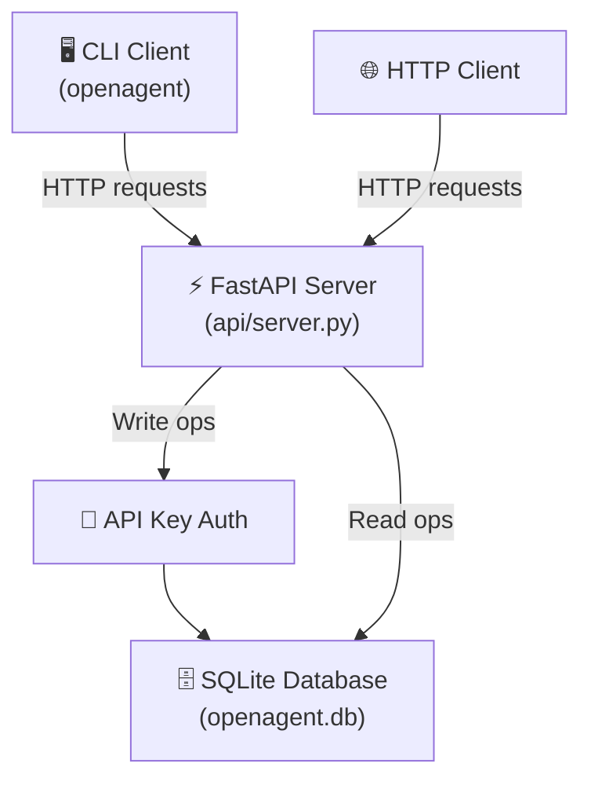

# 🚀 OpenAgentHub

[](https://github.com/thz20000921-ship-it/OpenAgentHub/actions)
[](https://opensource.org/licenses/MIT)
[](https://www.python.org/downloads/)

> A lightweight AI Agent tool registry and marketplace — think **npm, but for AI agents**.

OpenAgentHub provides a simple, self-hostable API for discovering, registering, and managing AI agent tools. It is designed to be the central catalog where developers publish their agent capabilities and consumers find the right tool for the job.

## ✨ Features

- **Tool Registry** — Register AI agent tools with rich metadata (name, version, author, tags, entry point).
- **Search & Filter** — Find tools by keyword, author, or tag via the search API.
- **API Key Authentication** — Write operations are protected; read operations are public.
- **CLI Client** — Manage tools from the command line with `openagent`.
- **SQLite Backend** — Reliable, zero-config persistent storage.
- **Lightweight & Fast** — Built on FastAPI, ready for production.
- **Self-Hostable** — Run your own private registry in seconds.

## 🏗️ Architecture



## 📂 Project Structure

```
OpenAgentHub/
├── api/
│   ├── __init__.py
│   ├── database.py      # SQLite data layer (CRUD + search)
│   └── server.py         # FastAPI application with route handlers
├── cli/
│   ├── __init__.py
│   └── main.py            # CLI client (click-based)
├── tests/
│   ├── conftest.py        # Shared pytest fixtures
│   └── test_api.py        # API test suite (15 test cases)
├── .github/
│   ├── workflows/ci.yml   # GitHub Actions CI pipeline
│   ├── ISSUE_TEMPLATE/    # Bug report & feature request templates
│   └── pull_request_template.md
├── pyproject.toml         # Project metadata & dependencies
├── CONTRIBUTING.md        # Contribution guidelines
├── LICENSE                # MIT License
└── README.md
```

## 🚀 Quick Start

### Prerequisites

- Python 3.10+
- pip

### Installation

```bash
# Clone the repository
git clone https://github.com/thz20000921-ship-it/OpenAgentHub.git
cd OpenAgentHub

# Create a virtual environment
python -m venv .venv
source .venv/bin/activate   # On Windows: .venv\Scripts\activate

# Install in development mode
pip install -e ".[dev]"
```

### Run the server

```bash
uvicorn api.server:app --reload --port 8000
```

On startup, the server will print a generated API key:
```
🔑 Generated API Key (set OPENAGENT_API_KEY env var to override):
   <your-api-key>
```

Then open [http://localhost:8000/docs](http://localhost:8000/docs) to explore the interactive Swagger UI.

## 📡 API Endpoints

| Method | Endpoint                | Auth Required | Description                        |
| ------ | ----------------------- | ------------- | ---------------------------------- |
| GET    | `/`                     | ❌            | Health check                       |
| GET    | `/tools`                | ❌            | List all registered tools          |
| GET    | `/tools/search`         | ❌            | Search tools (by keyword/author/tag) |
| GET    | `/tools/{tool_name}`    | ❌            | Get details of a specific tool     |
| POST   | `/tools/register`       | ✅            | Register or update a tool          |
| DELETE | `/tools/{tool_name}`    | ✅            | Delete a tool                      |

### Example: Register a new tool

```bash
curl -X POST http://localhost:8000/tools/register \
  -H "Content-Type: application/json" \
  -H "X-API-Key: YOUR_API_KEY" \
  -d '{
    "name": "web-scraper-agent",
    "version": "0.1.0",
    "description": "An agent that scrapes and summarizes web pages",
    "author": "alice",
    "tags": ["web", "scraper", "summarizer"],
    "entry_point": "http://localhost:9000/scrape"
  }'
```

### Example: Search tools

```bash
# Search by keyword
curl "http://localhost:8000/tools/search?q=scraper"

# Filter by tag
curl "http://localhost:8000/tools/search?tag=web"

# Filter by author
curl "http://localhost:8000/tools/search?author=alice"
```

## 🖥️ CLI Usage

```bash
# List all tools
openagent list

# Search for tools
openagent search "web scraper"
openagent search "agent" --tag web --author alice

# Get tool details
openagent info web-scraper-agent

# Register a new tool (interactive prompts)
openagent register

# Use a custom server
openagent --server http://my-registry:8000 list
```

## 🧪 Running Tests

```bash
# Run all tests
pytest tests/ -v

# Run with coverage
pytest tests/ -v --tb=short

# Lint check
flake8 api/ cli/ --max-line-length=120
```

## 🛣️ Roadmap

- [x] SQLite persistent storage
- [x] Search & filter API
- [x] API Key authentication
- [x] CLI client
- [x] GitHub Actions CI
- [ ] Tool versioning and changelogs
- [ ] Rate limiting
- [ ] Web-based dashboard
- [ ] Plugin system for custom backends
- [ ] Tool dependency management

## 🤝 Contributing

We welcome contributions! Please read our [Contributing Guide](CONTRIBUTING.md) for details.

## 📄 License

This project is open-source and available under the [MIT License](LICENSE).
